# Zero Trust Network Access (ZTNA) Lab

Infrastructure Cloud Azure provisionnée en Terraform, sécurisée progressivement avec WireGuard VPN, UFW et Fail2Ban. : aucun accès SSH direct depuis Internet, uniquement via un tunnel VPN chiffré .

Projet réalisé en combinant délibérément quatre axes : **Cloud** (Azure), **DevOps** (Terraform),**Network** (SSH, WireGuard , routage) et **Security** (UFW, Fail2Ban, hardening,Zero Trust).

---

## Sommaire

1. [Objectif du projet](#1-objectif-du-projet)
2. [Choix retenus et justificatifs](#2-choix-retenus-et-justificatifs)
3. [Architecture](#3-architecture)
4. [Stack technique](#4-stack-technique)
5. [Déroulé du projet, étape par étape](#5-déroulé-du-projet-étape-par-étape)
6. [Difficultés rencontrées et solutions apportées](#6-difficultés-rencontrées-et-solutions-apportées)
7. [Principes de sécurité appliqués](#7-principes-de-sécurité-appliqués)
8. [Reproduire l'infrastructure](#8-reproduire-linfrastructure)
9. [Améliorations futures](#9-améliorations-futures)
10. [Structure du repository](#10-structure-du-repository)

---

## 1. Objectif du projet

Construire une VM Linux sur Azure et la sécuriser étape par étape, jusqu'à ce que l'accès distant ne soit possible **que** via un VPN chiffré — jamais en direct. Le projet combine délibérément quatre axes complémentaires : Cloud, DevOps, Network et Security.

## 2. Choix retenus et justificatifs

| Décision | Choix retenu | Justification |
|---|---|---|
| Outil DevOps | Terraform seul (pas Ansible) | Meilleur ratio effort/valeur dans le temps imparti ; l'IaC est la compétence la plus demandée ; transférable AWS/GCP ; permet de détruire/recréer l'infra facilement pour économiser le crédit |
| Configuration VM | Manuelle (SSH, UFW, WireGuard, Fail2Ban) | Évite de cumuler deux courbes d'apprentissage (Terraform + Ansible). Ansible reste une amélioration future documentée plus bas |
| Taille VM | `Standard_B1s` | Éligible aux offres légères Azure, suffisant pour ce lab, limite la consommation du crédit étudiant |
| VPN | WireGuard | Léger, moderne, rapide à configurer, bon niveau pédagogique sur le chiffrement et le tunneling |
| Modèle de sécurité | Zero Trust (verify, least privilege, reduce attack surface, assume breach) | Ajoute une vraie dimension architecture sécurité au lab, au-delà de l'installation d'outils isolés |
| Gestion du crédit Azure | `deallocate` systématique de la VM après chaque session | Compte étudiant à crédit limité ; une VM allumée en continu consomme le crédit même sans usage actif |

En résumé : Terraform apporte la dimension DevOps sans surcharger le planning avec un second outil, tandis que la configuration de la VM reste manuelle pour garder le contrôle et bien comprendre chaque commande exécutée.

## 3. Architecture

Chaque couche (NSG, UFW, VPN, SSH, Fail2Ban) filtre ou surveille le trafic indépendamment des autres, de sorte qu'une seule couche compromise ne suffit pas à obtenir l'accès.

<p align="center">
  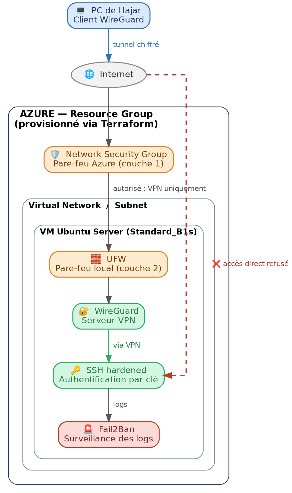
</p>

**Description du flux :**
- Le PC client se connecte via un tunnel WireGuard chiffré vers la VM Azure — c'est le seul chemin d'accès autorisé.
- Le Network Security Group (NSG) est la première couche de filtrage côté Azure : il n'autorise que le trafic nécessaire au VPN.
- UFW, sur la VM elle-même, agit comme seconde couche de pare-feu (défense en profondeur).
- WireGuard reçoit le tunnel VPN et donne accès au réseau interne de la VM.
- SSH n'est accessible qu'une fois passé par le VPN, et uniquement par authentification par clé (pas de mot de passe).
- Fail2Ban surveille les logs SSH et bannit automatiquement les tentatives suspectes.
- La flèche rouge en pointillés illustre le scénario bloqué : une tentative de connexion SSH directe depuis Internet, sans passer par le VPN, est refusée — c'est la preuve concrète du modèle Zero Trust.

L'ensemble de l'infrastructure Azure (Resource Group, VNet, Subnet, NSG, VM) est défini en code Terraform, versionné sur Git, et reproductible via `terraform apply` / `terraform destroy`.

## 4. Stack technique

- **Cloud** : Azure (Resource Group, VNet, Subnet, NSG, VM, IP publique)
- **DevOps** : Terraform, Git/GitHub
- **Network** : SSH, WireGuard, UFW, routage
- **Security** : Fail2Ban, SSH hardening, principes Zero Trust

---

## 5. Déroulé du projet, étape par étape

<details>
<summary><strong>Étape 1 — Infrastructure Azure via Terraform</strong> (cliquer pour déplier)</summary>

Setup du projet (`zerotrust-lab/`, repo Git, `.gitignore` excluant `.terraform/`, `*.tfstate`, `terraform.tfvars`), puis écriture du code Terraform bloc par bloc, avec un commit à chaque étape : provider `azurerm`, Resource Group `rg-zerotrust-lab`, VNet (`10.0.0.0/16`) + Subnet (`10.0.1.0/24`), NSG avec règle SSH restreinte à mon IP, IP publique statique, interface réseau, VM Linux `Standard_B1s` (Ubuntu 22.04) en authentification par clé SSH uniquement.

**Automatisation clé** : ajout d'une data source `http` (provider `hashicorp/http`) interrogeant `api.ipify.org` pour récupérer dynamiquement mon IP publique à chaque `terraform plan`/`apply`, afin d'éviter de mettre à jour `terraform.tfvars` manuellement à chaque changement d'IP.

Règle NSG avec IP dynamique (`data.http.my_ip`) :
<p align="center">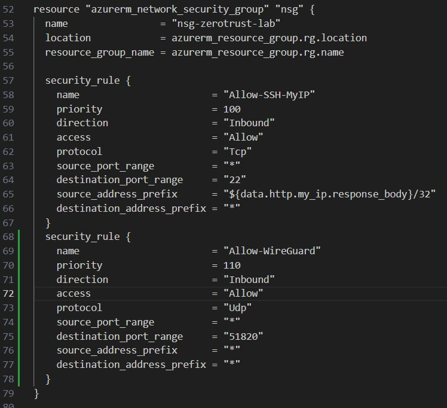</p>

`terraform plan` recalculant l'IP autorisée :
<p align="center">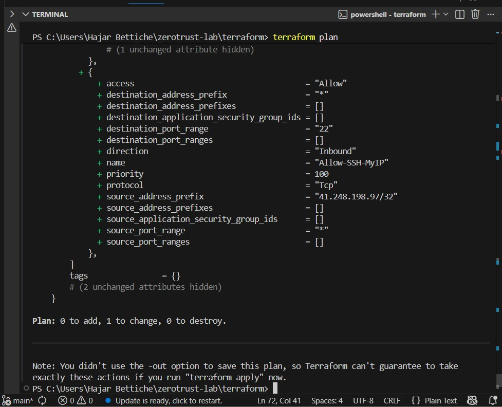</p>

`terraform apply` réussi :
<p align="center">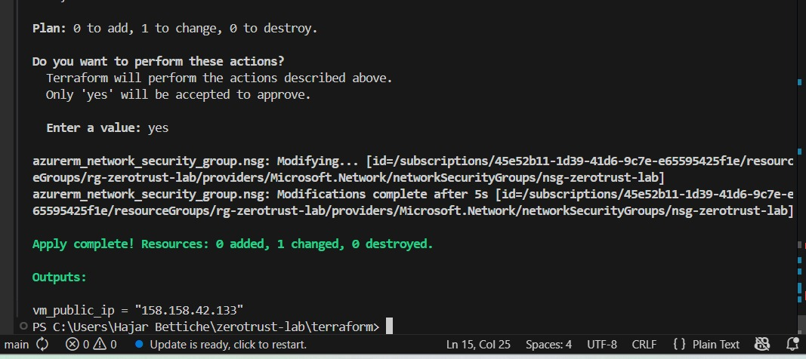</p>

`outputs.tf` — IP publique de la VM :
<p align="center">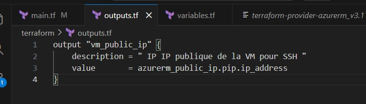</p>

Connexion SSH refusée sans la bonne clé :
<p align="center">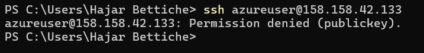</p>

Commits atomiques et push :
<p align="center">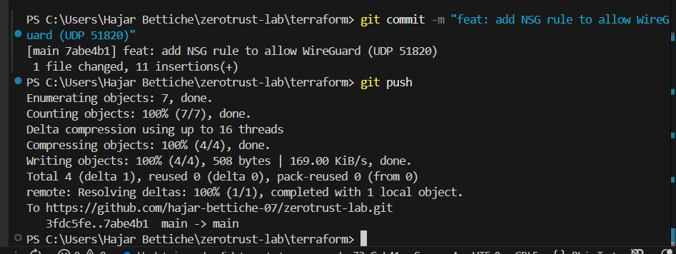</p>

**Résultat** : déploiement réussi (`8 resources added`), connexion SSH validée depuis PowerShell.

</details>

<details>
<summary><strong>Étape 2 — SSH Hardening + Fail2Ban</strong> (cliquer pour déplier)</summary>

Lecture attentive de `/etc/ssh/sshd_config` avec une distinction cruciale : une ligne commentée (`#`) représente une **valeur par défaut appliquée**, pas une option désactivée. Vérification qu'Azure désactive déjà `PasswordAuthentication` par défaut (via `admin_ssh_key`), puis ajout explicite de `PasswordAuthentication no` en défense en profondeur, et de `PermitRootLogin no` (plus strict que la valeur par défaut `prohibit-password`). Installation et activation de Fail2Ban.

**Méthodologie systématique** : test de connexion avant modification → modification → redémarrage du service → test après, dans un nouveau terminal, sans jamais fermer la session active, pour ne jamais risquer un verrouillage complet.

`sshd_config` — lignes commentées, valeurs par défaut appliquées :
<p align="center">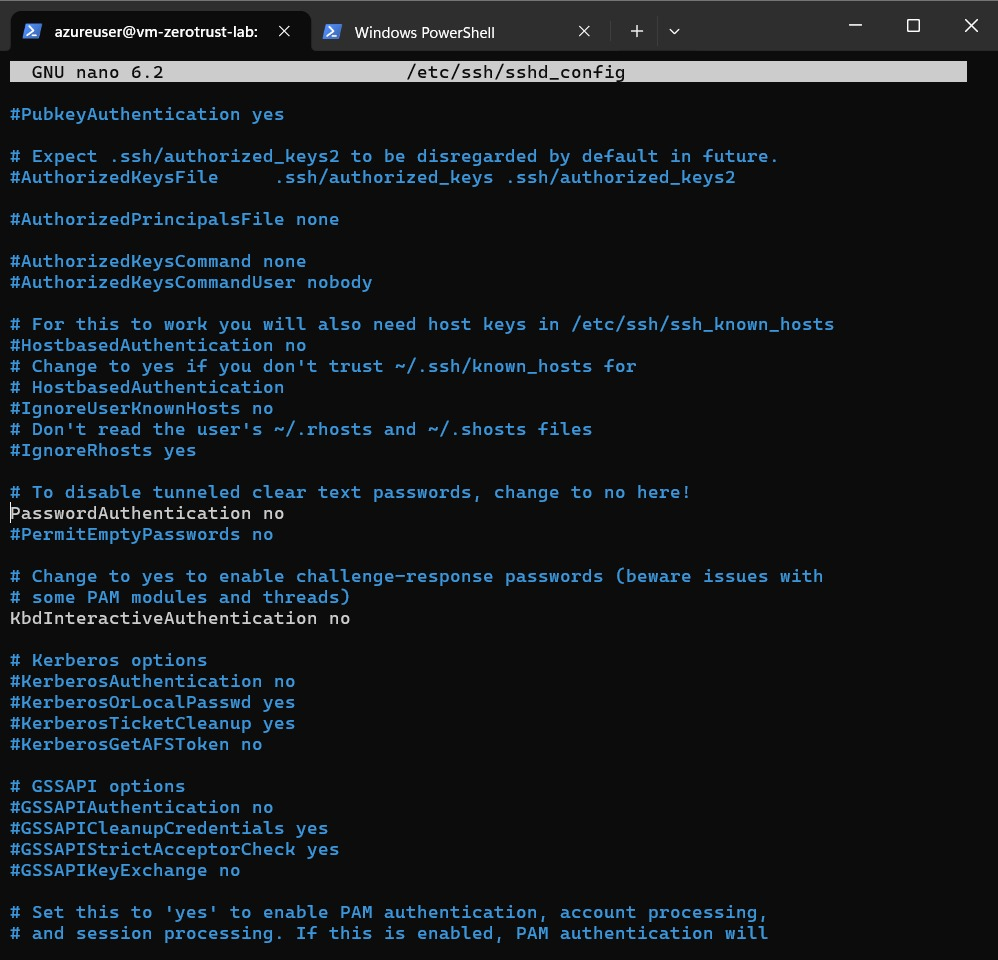</p>

`PermitRootLogin` encore à sa valeur par défaut avant durcissement :
<p align="center">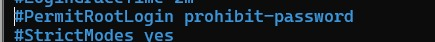</p>

`PasswordAuthentication no` confirmé :
<p align="center">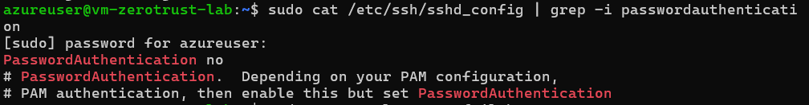</p>

Installation de Fail2Ban — erreur avant `apt update` :
<p align="center">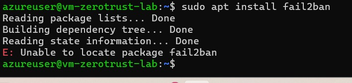</p>

Fail2Ban activé et rendu persistant au reboot :
<p align="center">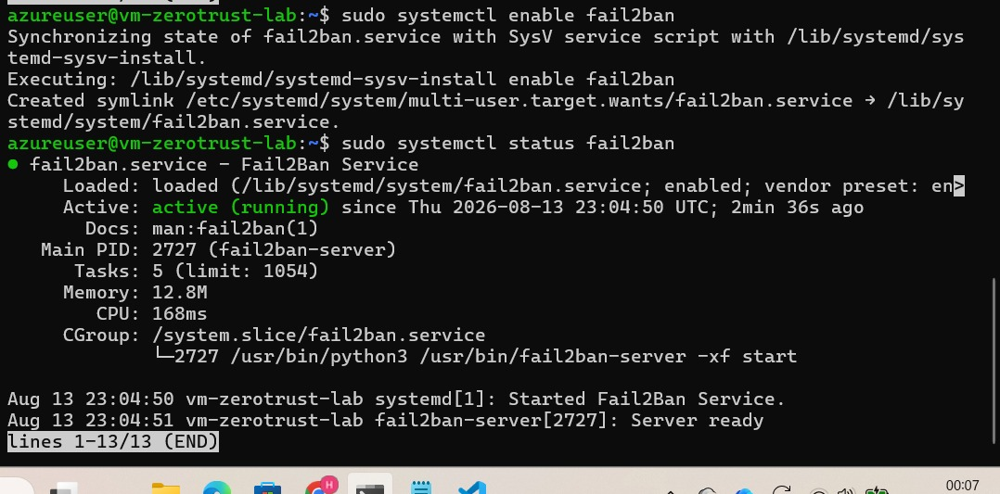</p>

**Principes illustrés** : défense en profondeur, least privilege, fail-safe avant modification, deny by default.

</details>

<details>
<summary><strong>Étape 3 — UFW (pare-feu local) et incident majeur</strong> (cliquer pour déplier)</summary>

Vérification de l'état initial (`inactive`), puis respect de l'ordre critique `ufw allow 22` **avant** `ufw enable` pour éviter un auto-blocage. Découverte que la règle par défaut autorisait `Anywhere` et non uniquement mon IP ; restriction appliquée, anciennes règles supprimées.

**Incident le plus formateur du projet** : mon FAI attribue une IP dynamique. Après un changement d'IP, le NSG s'est corrigé automatiquement (grâce à la data source `http`), mais **UFW, configuré manuellement, gardait l'ancienne IP en mémoire**. Résultat : SSH totalement inaccessible (`Connection timed out`), alors que le NSG était pourtant correct. Un classique cas de la poule et l'œuf : corriger UFW nécessitait du SSH, précisément ce qu'UFW bloquait.

**Solution** : activation des diagnostics de démarrage Azure, accès via la **Azure Serial Console** (accès hors-bande qui contourne entièrement le réseau, donc NSG et UFW), réinitialisation d'un mot de passe temporaire via `VMAccessForLinux`, puis correction de la règle UFW directement depuis la console.

**Décision architecturale qui en découle** : plutôt que d'automatiser aussi UFW (script cron ou bash envisagés), j'ai choisi de laisser UFW ouvert sur le port SSH sans restriction d'IP, et de m'appuyer uniquement sur le NSG — déjà automatisé — comme seule couche de filtrage par adresse IP. C'est un compromis assumé : perte partielle de la défense en profondeur sur ce point précis, au bénéfice d'une infrastructure plus simple à maintenir sans intervention manuelle répétée à chaque changement de réseau.

UFW inactif par défaut (`deny incoming`) :
<p align="center">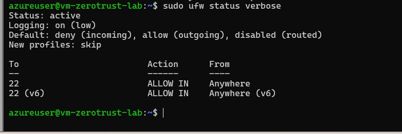</p>

`allow 22` avant `enable` :
<p align="center">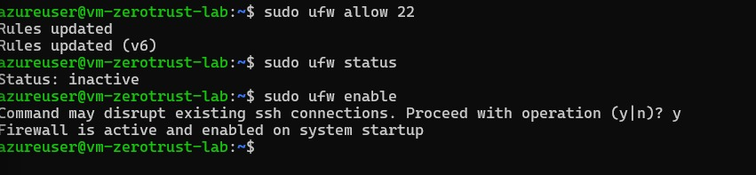</p>

Restriction à mon IP personnelle :
<p align="center">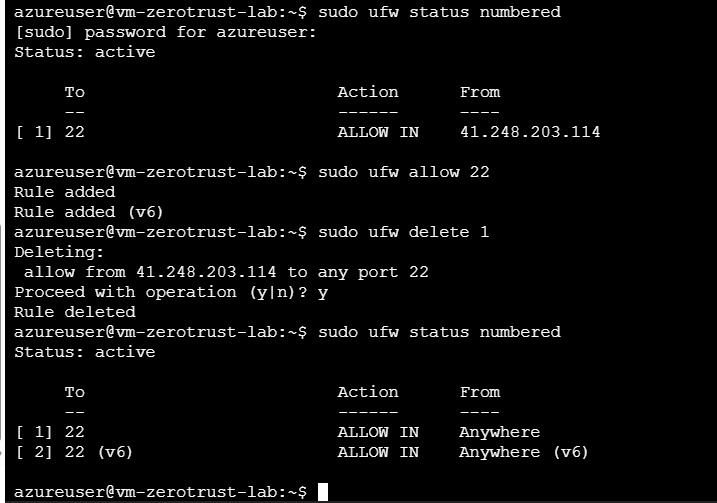</p>

Suppression des anciennes règles :
<p align="center">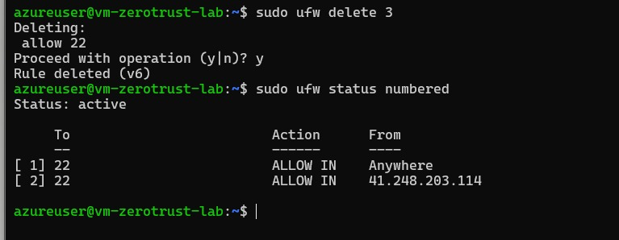</p>

Récupération via la Azure Serial Console :
<p align="center">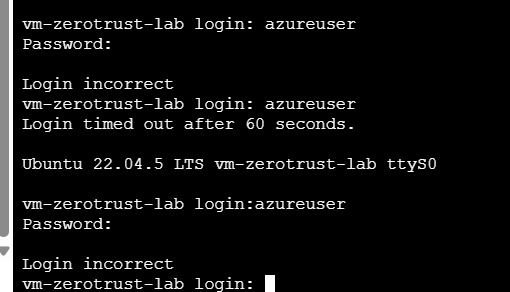</p>

</details>

<details>
<summary><strong>Étape 4 — WireGuard VPN</strong> (cliquer pour déplier)</summary>

Installation de WireGuard, génération de deux paires de clés distinctes (serveur et client) avec permissions restreintes (`chmod 600` sur les clés privées). Clés client générées via l'application WireGuard officielle (Windows). Configuration de l'interface serveur (`wg0.conf` : IP interne VPN, port d'écoute, peer autorisé), configuration du client, ouverture du port UDP 51820 dans le NSG et UFW, puis test réussi du tunnel.

**Point pédagogique clé** : contrairement au NSG/UFW qui filtrent par IP (vulnérables aux IP dynamiques), WireGuard authentifie par **identité cryptographique** (clé publique) — un changement d'IP côté client n'a aucune incidence sur l'accès VPN.

Génération des clés serveur (`wg genkey`) :
<p align="center">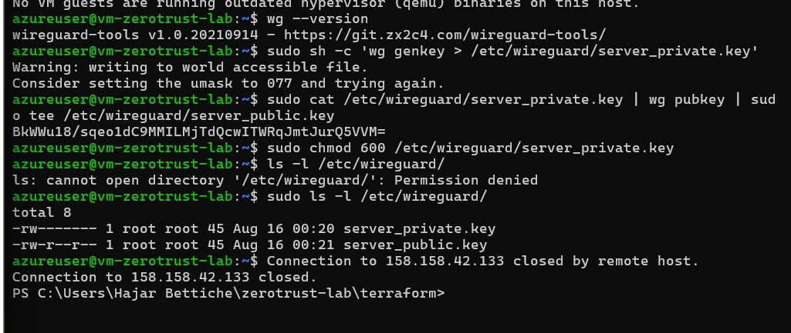</p>

Configuration serveur `wg0.conf` :
<p align="center">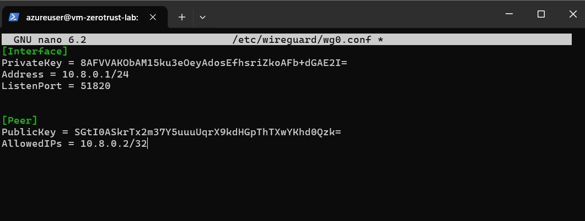</p>

`wg-quick up wg0` :
<p align="center">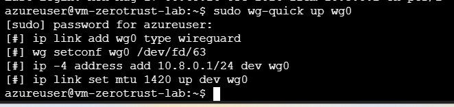</p>

`wg show` — interface et peer actifs :
<p align="center">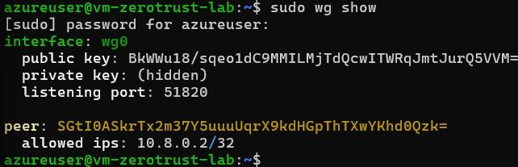</p>

Application WireGuard côté client, tunnel actif :
<p align="center">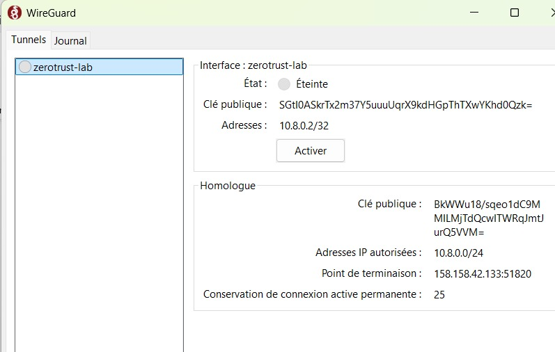</p>

Test du tunnel (ping réussi) :
<p align="center">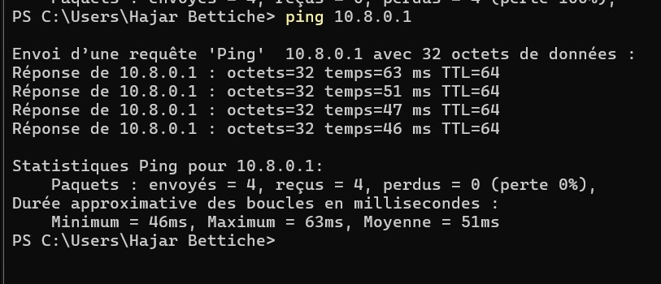</p>

Persistance au reboot (`systemctl enable`) :
<p align="center"></p>

</details>

<details>
<summary><strong>Étape 5 — Zero Trust : bascule SSH via VPN uniquement</strong> (cliquer pour déplier)</summary>

Modification du NSG (règle `Allow-WireGuard`, UDP 51820) et d'UFW (SSH restreint au sous-réseau interne du VPN, `10.8.0.0/24`) pour bloquer tout accès SSH direct depuis Internet. Tests des deux scénarios : accès direct refusé, accès via VPN accepté.

Règle NSG `Allow-WireGuard` (UDP 51820) :
<p align="center">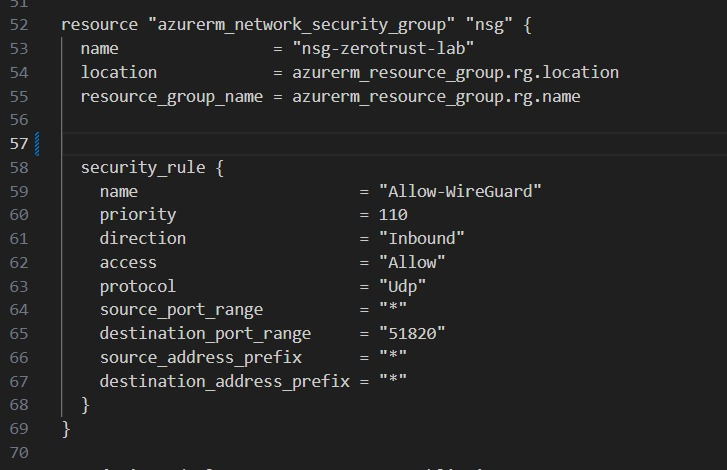</p>

UFW — SSH restreint au sous-réseau VPN :
<p align="center"></p>

SSH direct → `Connection timed out` :
<p align="center">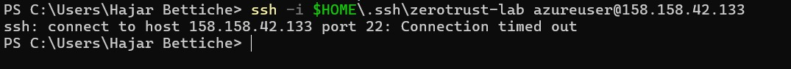</p>

**Preuve Zero Trust** : accès direct refusé, accès via VPN (`10.8.0.1`) accepté :
<p align="center">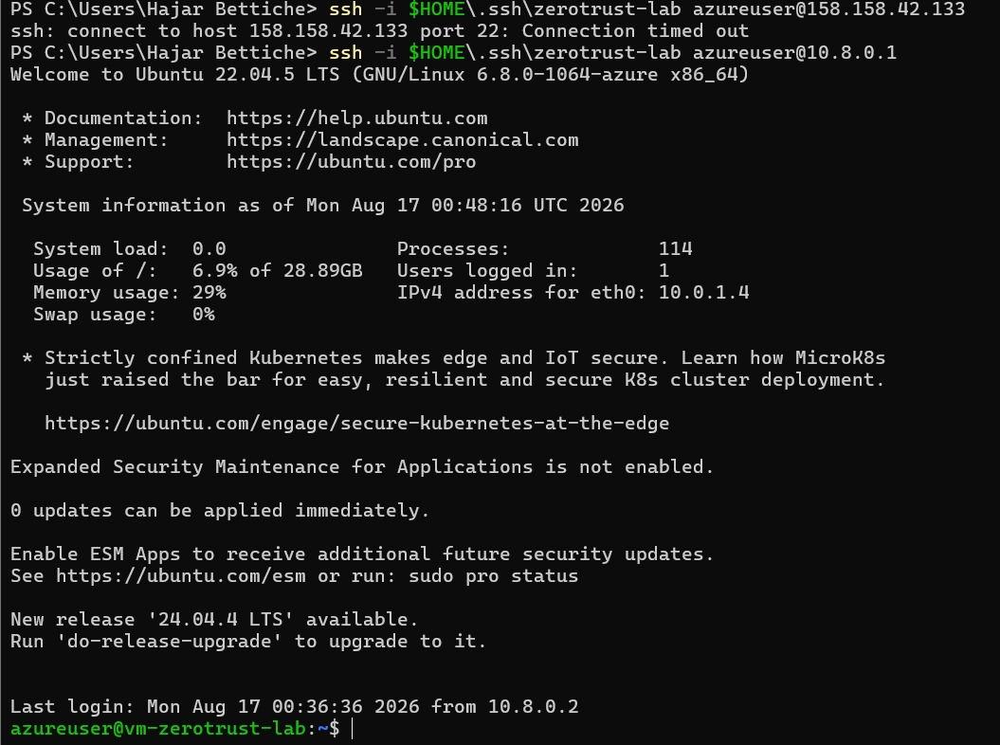</p>

</details>

<details>
<summary><strong>Étape 6 — Fail2Ban avancé (test réel) et auto-bannissement</strong> (cliquer pour déplier)</summary>

Création d'une jail SSH personnalisée (`jail.local` : `maxretry 3`, `bantime 600s`). Test réel : simulation de tentatives de connexion échouées avec un faux utilisateur, depuis mon propre poste — le seul peer VPN configuré à ce moment. Après la 3ᵉ tentative, mon IP a été automatiquement bannie, coupant **à la fois** les nouvelles tentatives et ma session déjà active — ce que je n'avais pas anticipé.

**Analyse critique** : le filet de sécurité initialement prévu (garder une session déjà active ouverte) s'est révélé insuffisant, car Fail2Ban/UFW peuvent couper des connexions déjà établies. Récupération via la Azure Serial Console, déjà configurée depuis l'incident précédent.

**Bonus pédagogique découvert en parallèle** : WireGuard ne redémarrait pas automatiquement au reboot (service non `enabled`), et une régression sur `PasswordAuthentication` (repassée à `yes` par erreur) s'était réintroduite — les deux corrigés.

**Leçon retenue** : un vrai filet de sécurité pour ce type de test doit être préparé **avant** la manipulation (accès console vérifié, mot de passe temporaire prêt), pas découvert dans l'urgence après coup.

`jail.local` — configuration personnalisée :
<p align="center">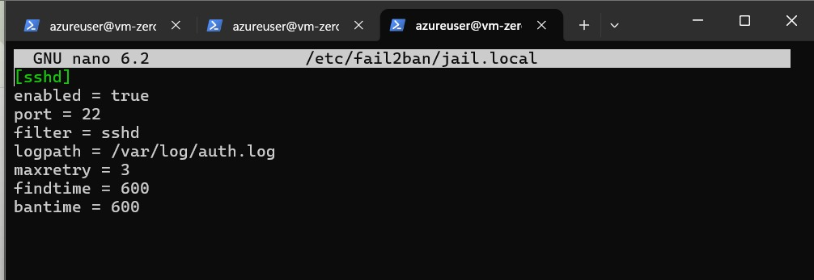</p>

Fail2Ban actif :
<p align="center">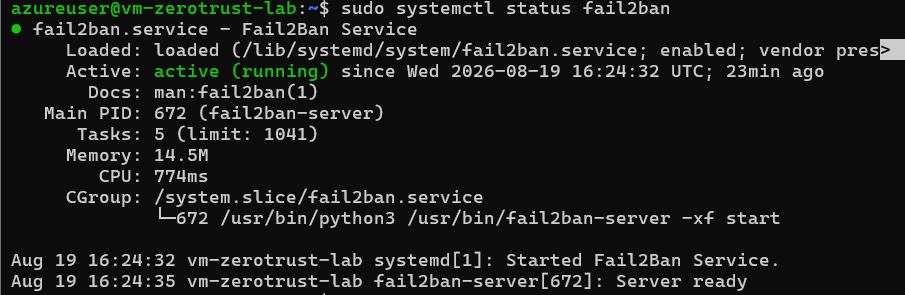</p>

Test déclencheur : 3 échecs puis `Connection timed out` :
<p align="center">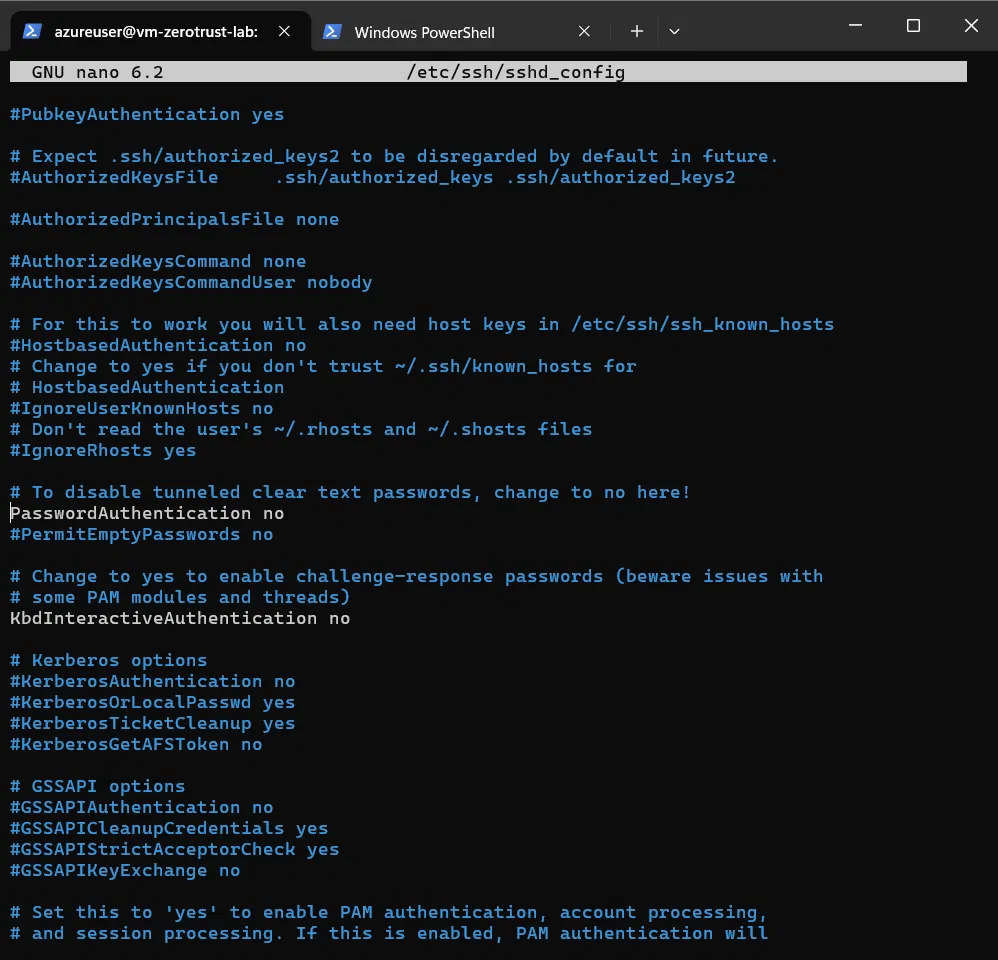</p>

`Total banned: 1` après le test :
<p align="center">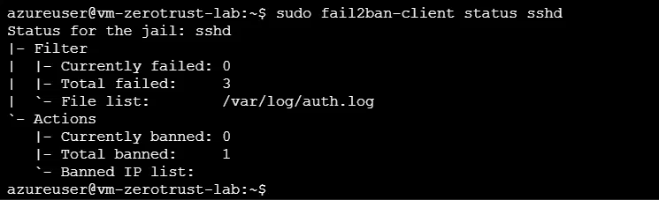</p>

IP bannie visible, puis commande `unban` :
<p align="center">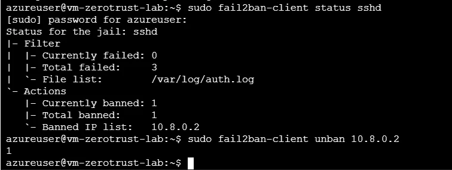</p>

Statut après débannissement :
<p align="center">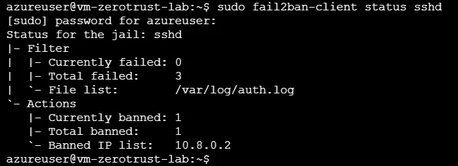</p>

Régression détectée : `PasswordAuthentication yes` :
<p align="center">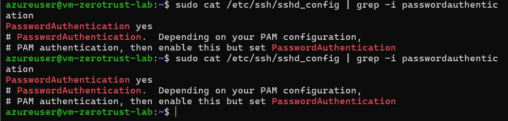</p>

Régression corrigée, retour à `no` :
<p align="center">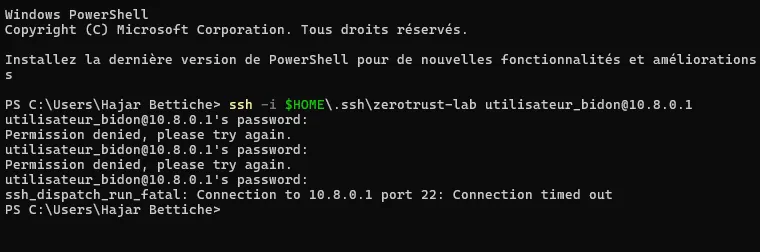</p>

</details>

<details>
<summary><strong>Étape 7 — Finalisation</strong> (cliquer pour déplier)</summary>

Nettoyage du code Terraform : suppression de la variable `my_ip` et de la data source `http`, devenues obsolètes depuis que SSH ne passe plus que par le VPN. Vérification finale du `.gitignore`, commit et push, puis `terraform destroy` pour libérer entièrement les ressources Azure.

`git status` propre après nettoyage :
<p align="center">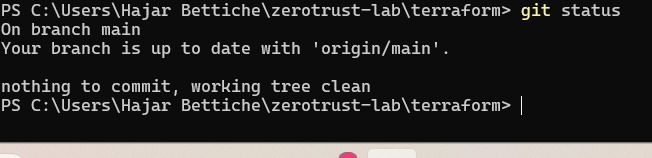</p>

Commit du fichier de lock Terraform :
<p align="center">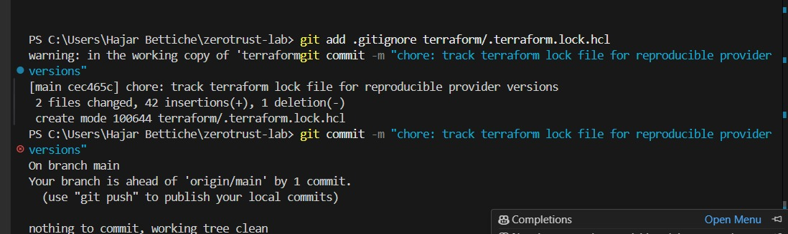</p>

</details>

---

## 6. Difficultés rencontrées et solutions apportées

### Clé SSH refusée par Azure
Lors du premier `terraform apply`, la création de la VM a échoué : Azure n'accepte que les clés RSA pour `admin_ssh_key`, or ma clé était en `ed25519`. Régénération en RSA 4096 bits (`ssh-keygen -t rsa -b 4096`), mise à jour du chemin dans les variables Terraform, déploiement réussi.

### Restriction de région sur le compte Azure for Students
Le déploiement échouait systématiquement avec des erreurs `403 Forbidden` en `westeurope` puis `northeurope` — une policy Azure limite les régions disponibles pour mon abonnement. Identification de la liste des régions autorisées via Azure Policy (Assignments → Allowed locations), migration vers `spaincentral`. Comme tous les blocs Terraform référencent la région du Resource Group plutôt que des valeurs codées en dur, un seul changement a suffi à corriger toute l'infrastructure.

### Incident majeur : blocage SSH suite à un changement d'IP dynamique
La difficulté la plus formatrice du projet — détaillée à l'étape UFW ci-dessus. Le NSG (automatisé via une data source) s'est corrigé seul après un changement d'IP, mais UFW (manuel) est resté bloqué sur l'ancienne IP, provoquant un `Connection timed out` total malgré un NSG pourtant correct. Récupération via la Azure Serial Console, puis décision assumée de ne pas automatiser UFW davantage et de s'appuyer uniquement sur le NSG pour le filtrage par IP — une automatisation plus poussée (par exemple via Ansible) reste une piste d'amélioration identifiée pour une prochaine itération.

### Auto-bannissement lors du test de Fail2Ban
Détaillé à l'étape Fail2Ban avancé ci-dessus. Un test de sécurité à risque doit être préparé avec un véritable filet de sécurité vérifié **à l'avance** — l'accès console série aurait dû être testé et prêt avant de lancer le test, plutôt que découvert dans l'urgence après le blocage.

### Service WireGuard non persistant au redémarrage
Constat que WireGuard ne redémarrait pas automatiquement après un reboot, contrairement à Fail2Ban. Correction avec `sudo systemctl enable wg-quick@wg0`, garantissant que le tunnel VPN redevienne actif automatiquement à chaque démarrage.

---

## 7. Principes de sécurité appliqués

- **Défense en profondeur** — NSG + UFW + WireGuard + SSH par clé, comme couches indépendantes : bloquer le mot de passe SSH explicitement même si Azure le bloquait déjà par défaut, par exemple.
- **Least privilege** — `PermitRootLogin no`, accès uniquement via un utilisateur nominatif passant par `sudo`.
- **Deny by default** — politique `deny (incoming)` d'UFW, NSG n'autorisant que des ports précis.
- **Zero Trust ("never trust, always verify")** — SSH jamais accessible directement depuis Internet, même avec la bonne IP.
- **Détection et réponse** — Fail2Ban : surveillance des logs, ban automatique, testé en conditions réelles.
- **Fail-safe avant modification** — toujours valider l'alternative avant de couper un mécanisme d'accès, dans un nouveau terminal, sans fermer la session active.

## 8. Reproduire l'infrastructure

```bash
cd terraform/
terraform init
terraform plan
terraform apply

# ... configuration manuelle de la VM (SSH hardening, UFW, WireGuard, Fail2Ban) ...

terraform destroy   # en fin de session, pour ne rien laisser tourner
```

⚠️ Sur un compte Azure for Students, penser à `az vm deallocate` en fin de session (pas juste un `stop` depuis l'OS) pour ne pas consommer le crédit inutilement entre deux sessions.

## 9. Améliorations futures

- **Ansible** pour automatiser la configuration actuellement manuelle de la VM (SSH, UFW, WireGuard, Fail2Ban), et notamment synchroniser UFW avec l'IP dynamique sans intervention manuelle.
- Ajout d'un second peer WireGuard pour éviter la situation d'auto-bannissement rencontrée lors des tests Fail2Ban.
- Monitoring centralisé des logs (ex. Grafana + Loki) plutôt qu'une lecture manuelle des logs Fail2Ban/UFW.

## 10. Structure du repository

```
zerotrust-lab/
├── README.md
├── terraform/
│   ├── main.tf
│   ├── variables.tf
│   ├── outputs.tf
│   └── .terraform.lock.hcl
├── .gitignore
└── screenshots/
    ├── architecture-schema.png
    ├── etape1-terraform/
    ├── etape2-ssh-hardening/
    ├── etape3-ufw-incident/
    ├── etape4-wireguard/
    ├── etape5-zero-trust/
    ├── etape6-fail2ban-avance/
    └── etape7-finalisation/
```

---

*Projet réalisé par Hajar Bettiche — Ingénieure Cloud Computing & Virtualisation, UIR.*
