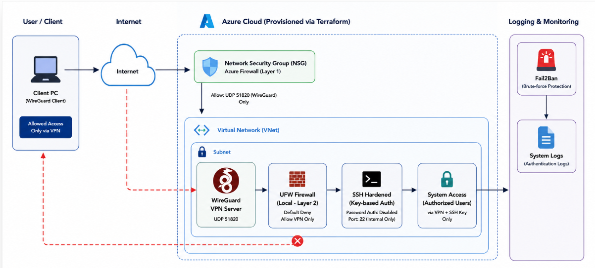
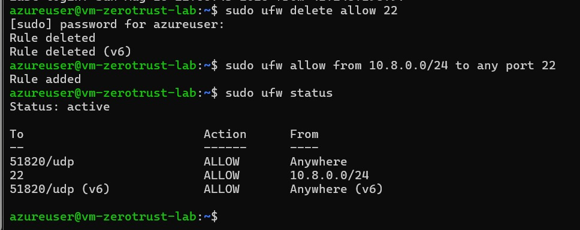
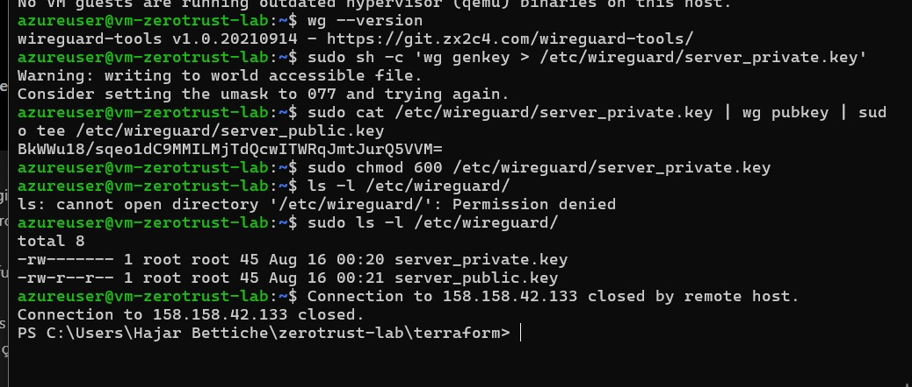
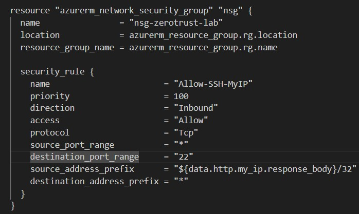
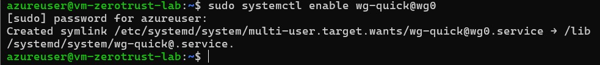

# Azure-Zero Trust Network Access Lab

Applying Zero-Trust principles to secure remote administration of an Azure VM.

Only WireGuard is exposed to the internet. SSH is dropped at the Azure NSG and reachable exclusively from the VPN subnet. Terraform manages the Azure layer; the Linux config was done by hand to understand how the cloud and host controls interact, which is also why a good chunk of what's below is things that broke.

## Why

The goal was the smallest useful secure admin path: expose only WireGuard publicly, bring up an authenticated encrypted tunnel, and keep SSH reachable only from inside that tunnel. Nothing on port 22 answers from the open internet. The architecture is deliberate, not a pile of tools stacked together.

## Stack

Azure (VNet, subnet, NSG, public IP, Linux VM) · Terraform (`azurerm`, `http`) · WireGuard · UFW · Fail2Ban · OpenSSH · Ubuntu 22.04

## Layout

```
Internet
   │
   ├── UDP 51820 ──► WireGuard  (only public entry point)
   │
   └── TCP 22 ─────► DROPPED at NSG
                          │
                     WireGuard tunnel
                          │
                     10.8.0.0/24
                          │
                          ▼
                     UFW ──► sshd
```



- **NSG**: UDP 51820 allow, TCP 22 deny, deny inbound otherwise. SSH has no public route.
- **UFW**: 22 allowed only from `10.8.0.0/24`, deny inbound otherwise.
- **WireGuard**: `wg0` on the VM, peers keyed by public key, so a client IP change doesn't affect access.
- **sshd**: key auth only, `PermitRootLogin no`, `PasswordAuthentication no`.
- **Fail2Ban**: sshd jail, `maxretry 3`, `bantime 600`.

## Access, before and after


`ssh` to the public IP times out. `ssh` to `10.8.0.1` (the tunnel) gets in. `Last login … from 10.8.0.2` is the WireGuard peer.



UFW allows 22 only from the VPN subnet.

## WireGuard

Server on `10.8.0.1/24`, UDP 51820, client pinned by `AllowedIPs = 10.8.0.2/32`.


Private keys `chmod 600`, verified with `ls -l`:



## Validation

```bash
# Public SSH, should fail
ssh azureuser@<public-ip>
#  ssh: connect to host <public-ip> port 22: Connection timed out

# SSH over the tunnel, should authenticate
ssh azureuser@10.8.0.1
#  azureuser@vm-zerotrust-lab:~$

# Tunnel is up
sudo wg show
#  peer: ...  latest handshake: ...

# Host firewall scope
sudo ufw status verbose
#  22   ALLOW IN   10.8.0.0/24

# Jail is active
sudo fail2ban-client status sshd
#  Jail: sshd   Currently banned: ...
```

## Things that broke

**Locked out after an IP rotation (earlier iteration).** At that point UFW still had a rule pinned to my public client IP. When the ISP address changed, the NSG updated itself through an `http` data source but UFW didn't, and fixing UFW needed SSH, which UFW was now blocking. Got back in via the Azure Serial Console (out-of-band, ignores NSG/UFW). The final design removes this dependency entirely: SSH is allowed only from the WireGuard subnet, so there's no public-IP rule left to drift.

That earlier NSG used the dynamic-IP trick to avoid editing tfvars on every rotation:

```hcl
source_address_prefix = "${data.http.my_ip.response_body}/32"
```



Once SSH moved behind the VPN, the `my_ip` variable and the `http` data source were removed as dead code.

**Fail2Ban banned me mid-test.** Ran failed logins from my only peer to check the jail worked, hit the ban, and lost the live session too. It drops established connections, not just new ones. Serial console again. Should've had that verified before testing rather than after.



**WireGuard didn't come back after reboot.** Service wasn't enabled. `systemctl enable wg-quick@wg0`.

**`ed25519` rejected** by Azure for admin auth, regenerated RSA 4096.

**403 on apply**. Azure for Students region policy. Found the allowed list under Azure Policy → Allowed locations, moved everything to `spaincentral`. One RG change since nothing was hardcoded.

## TODO

- Ansible for the manual config (sshd, UFW, WireGuard, Fail2Ban) so the box is reproducible, not just the infra
